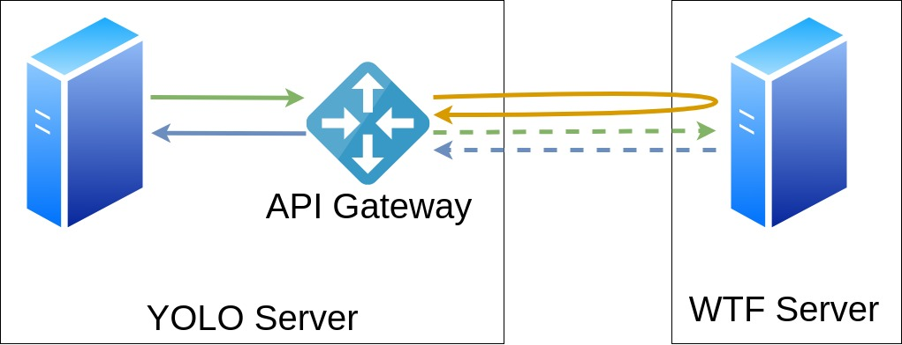

#Proposed Solution to Game 02

##Problem
WTF Server tends to be very unstable, having latency peaks every now and then that end in response timeouts.

##Solution
To solve this problem, the following patterns will be used: Api Gateway, Health Check and Circuit Breaker.

#### Api Gateway Pattern
The API Gateway manages the requests made by the application through a single point, thus allowing to verify if WTF is available before making the request preventing overloads for times out.

#### Health Checker Pattern
It is used to perform a prior verification of the status of an external service before making a query, thus checking if the service can process our request.

#### Circuit Breaker
In case of finding problems with the service we are consulting, we can temporarily stop requests to this service and make periodic consultations until the service is restored and make requests to it again.

The following graphic shows in a simple way the architecture to follow.

###Concepts:
**YOLO Server:** Represents the YOLO Server

**WTF Server:** Represents the WTF Server

**API Gateway:** Represents the component that manages the connections to the services that YOLO needs, in this case WTF.

**Flat Green Arrow:** Represents the request from YOLO to API Gateway.

**Flat Blue Arrow:** Represents the response from API Gateway to YOLO.

**Flat Orange Arrow:** Represents the request to check the health status of WTF.

**Dotted Green Arrow:** Represents the request from API Gateway to WTF.

**Dotted Blue Arrow:** Represents the response from API Gateway to WTF.

###Explanation
1. Yolo makes a request to API Gateway (Flat Green Arrow)
2. API Gateway generate a check request to WTF Server using a short timeout. (Flat Orange Arrow)
3. WTF Server tries respond to the request with information about the current state of the server.
4. The API Gateway analyzes the result information taking into account various factors such as response time and current server load. If the Gateway API considers that WTF can respond to the request, it will execute it, otherwise it will respond with a connection error. (Dotted Green Arrow or Flat Blue Arrow)
If this server health check fails 10 times, it will be assumed that WTF is not available and API Gateway will deactivate the requests to WTF and will respond all future requests with error.
After 10 seconds API Gateway will try to contact WTF again, if the server's health response is positive it will again make requests to the server, otherwise the blocking will be maintained for 10 more seconds.
5. WTF will process and response the request (Dotted Blue Arrow)
6. API Gateway will pass the response to the app (Flat Blue Arrow)

###Why?
The easiest way to manage connections is through a single point, so you can check if WTF is available before making the actual request saving time.

At some point I considered using Service Registry or Self Registration but if WTF has problems with just staying online, I don't think he can timely report whether it is available or not. 

And placing the API Gateway in WTF would load the server even more and make it more prone to errors, YOLO has the best server in the market.

### What could we change?
Instead of integrating the health checker into the API Gateway, it could be placed in an external service and have the API gateway query this service to find out if WTF is available or not.